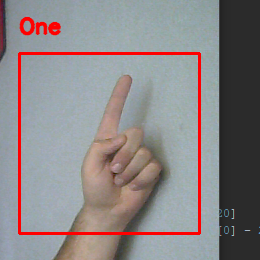
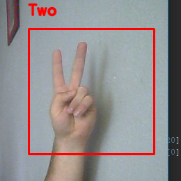
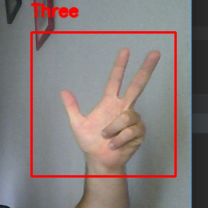
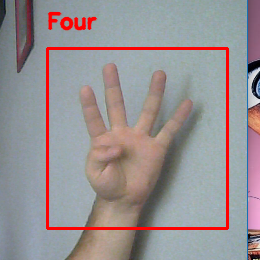
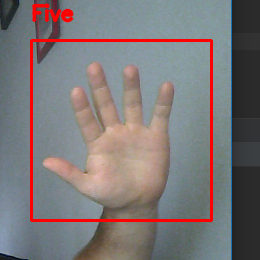

**Jako cel postawiłem sobie stworzenie aplikacji, która za pomocą kamerki będzie rozpoznawać gesty dłoni.**    

## Krok pierwszy: zbieranie danych uczących
Zebrałem ponad 2000 zdjęć dłoni, co było już wystarczającą ilością danych, by myśleć o tworzeniu modelu. 
Szczególnie dziękuję moim kolegom: Piotrkowi, Piotrkowi, Pawłowi i Jędrzejowi za pomoc w robieniu zdjęć.

## Krok drugi: Stworzenie sieci neuronowej i wyuczenie jej
Sieć zamodelowałem w Pythonie z pomocą biblioteki Keras, którą z łatwością można się nauczyć i całkiem nieźle
sprawdza się w tematach sieci neuronowych.  

## Krok trzeci: aplikacja i testowanie
Aplikacja również została napisana napisana w Pythonie, tym razem z pomocą biblioteki OpenCV. Jako źródło obrazu wykorzystałem
zewnętrzną kamerkę internetową. A oto otrzymane rezultaty:  

|   |   |   |   |   |
| --- | --- | --- | --- | --- |
|  |  |  |  |  |

